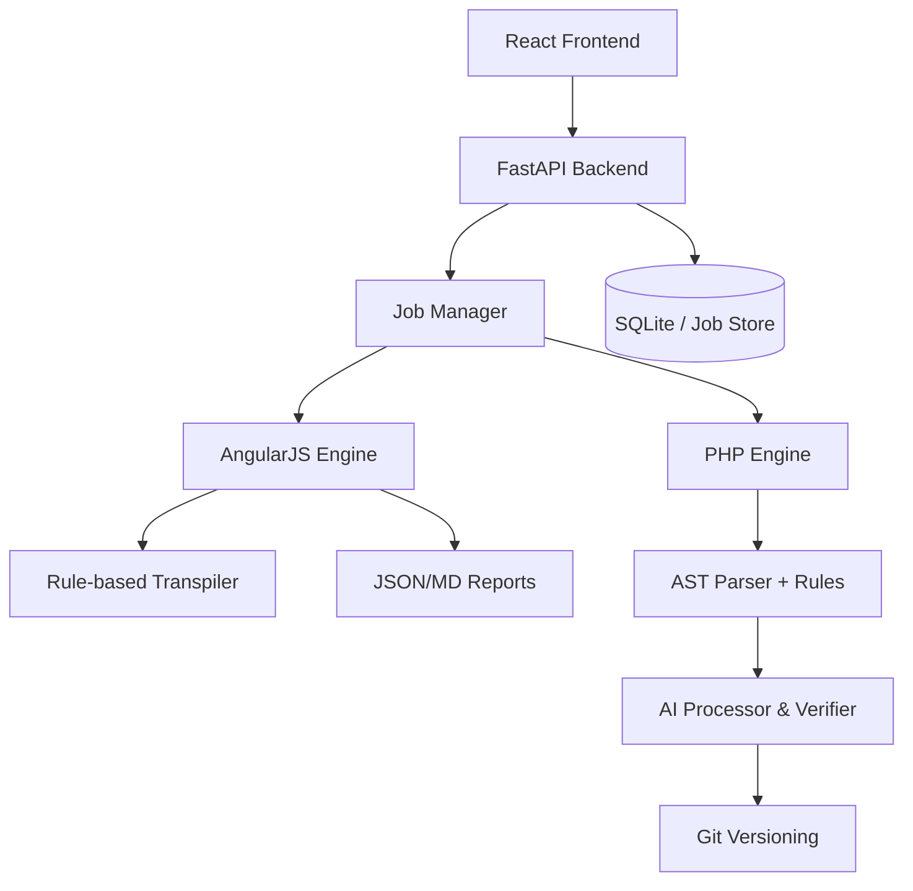

# 🚀 EVUA — Enterprise Visionary Upgrade Assistant

**Modernizing Legacy Ecosystems with AI-Powered Intelligence**

EVUA is an enterprise-grade automated modernization platform designed to migrate legacy codebases (AngularJS and PHP) to modern, secure, and maintainable architectures. By combining **AST-based rule engines** with **Advanced AI Verification**, EVUA achieves 80-90% automation in real-world transformation journeys.

---

## 🛠️ Unified Migration Engines

EVUA features a modular architecture with specialized engines for different technology stacks:

### 🅰️ AngularJS Engine
*Legacy AngularJS (1.x) → Modern Angular (v17+)*
- **Componentization**: Automatically converts Controllers and `$scope` logic into Angular Components.
- **Service Migration**: Transforms Services and Factories into `@Injectable` services.
- **Dependency modernizing**: Replaces `$http` with `HttpClient` and `$q` with RxJS.
- **RxJS Integration**: Converts simple `$scope.$watch` patterns into `BehaviorSubject` and Observables.

### 🐘 PHP Engine
*Legacy PHP (5.6+) → Modern PHP (8.x+)*
- **AST Parsing**: Full Abstract Syntax Tree analysis for accurate code transformation.
- **Version Control**: Built-in Git integration to track every migration step as a commit.
- **AI Verification**: Automatically passes high-risk code through Gemini/OpenAI for logic verification.
- **Safe Refactoring**: Handles deprecated functions, type hinting, and modern syntax patterns.

---

## ✨ Key Features

- **🎯 Risk Assessment Dashboard**: Automated heuristics calculate complexity and risk scores (Low, Medium, High, Critical) for every file.
- **🤖 AI-Powered Refactoring**: Integrated LLM adapters for handling complex logic that deterministic rules can't solve.
- **🌓 Side-by-Side Workspace**: High-fidelity diff editor (powered by CodeMirror) for manual review and approval of changes.
- **📈 Validation Pipeline**: Integrated benchmarking harness to measure migration accuracy and regression.
- **🔄 Git-Based Rollbacks**: Snapshot-based version control allowing you to revert or branch migration attempts.

---

## 🧠 Architecture Overview



---

## 🚀 Quick Start

### Prerequisites
- **Python 3.10+**
- **Node.js 18+**
- **Docker** (Optional, for easy setup)

### Installation

1. **Clone and Setup Backend**
   ```bash
   cd backend
   pip install -r requirements.txt
   uvicorn app.main:app --reload --port 8000
   ```

2. **Setup Frontend**
   ```bash
   cd frontend
   npm install
   npm run dev
   ```

3. **Configure Environment**
   Create a `.env` in the `backend` folder:
   ```env
   GEMINI_API_KEY=your_key_here
   OPENAI_API_KEY=your_key_here
   ```

---

## 📊 Project Roadmap

### Phase 1: MVP (Complete ✅)
- [x] Basic AngularJS Controller/Service migration.
- [x] PHP AST Parsing and rule application.
- [x] Unified FastAPI backend with Job tracking.
- [x] React-based Workspace and Dashboard.

### Phase 2: Intelligence (In Progress 🚧)
- [ ] **AngularJS**: Template binding refactoring and Directive conversion.
- [ ] **PHP**: Deep static analysis for security vulnerabilities.
- [ ] **AI**: Enhanced feedback loops for self-correcting migrations.

### Phase 3: Enterprise Scale (Planned ⏳)
- [ ] Multi-project workspace management.
- [ ] CI/CD integration for automated modernization PRs.
- [ ] Support for React/Vue as target frameworks.

---

## 🤝 Contributing

We welcome contributions to the migration rules, AI adapters, and UI components! Please see our [Contributing Guide](documentation/CONTRIBUTING.md) for more details.

---

## 📌 TL;DR
EVUA isn't a simple script—it's a **Modernization Operating System**. Whether you are killing off an old AngularJS app or breathing life into a PHP 5.6 monolith, EVUA provides the tools, visibility, and automation to do it safely at scale.
