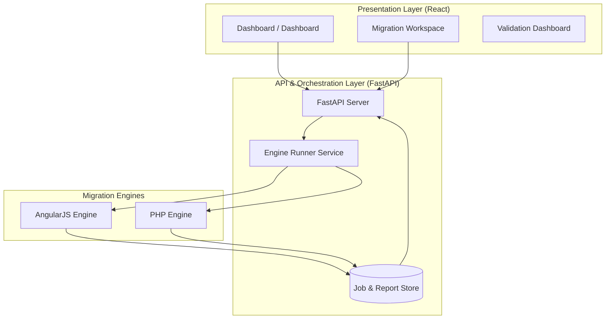

# EVUA System Architecture

EVUA (Enterprise Visionary Upgrade Assistant) is an automated modernization platform designed to migrate legacy codebases to modern architectures. This document outlines the technical architecture, data flow, and component breakdown of the entire project.

## High-Level Overview

EVUA is built on a decoupled architecture comprising three main blocks:
1. **Frontend**: React-based dashboard and workspace.
2. **Backend**: FastAPI orchestrator for job management and API serving.
3. **Engines**: Specialized migration pipelines for AngularJS and PHP.

---

## 1. Frontend Architecture (React)
The frontend is a modern SPA designed for high-fidelity code review and migration management.

- **Stack**: React, Vite, Tailwind CSS, Lucide Icons.
- **Key Modules**:
    - **Dashboard**: High-level metrics, risk distribution, and historical analysis.
    - **Workspace**: Interactive side-by-side diff editor powered by **CodeMirror**, providing AI-generated code previews vs. legacy original code.
    - **Validation**: Visualization of test results, snapshot comparisons, and coverage metrics.
    - **Shared Components**: High-fidelity UI kit (Cards, Modals, Terminal logs).

---

## 2. Backend Architecture (FastAPI)
The backend acts as a bridge between the user interface and the heavyweight migration engines.

- **FastAPI Router**: Defines endpoints for project upload, migration trigger (`/migrate`), and report retrieval (`/report`).
- **Engine Runner (`engine_runner.py`)**: 
    - Handles file system operations (Extraction of uploads).
    - Manages subprocess execution for CLI-based engines.
    - Captures real-time logs and streams them (abstracted) back to the client.
- **Job Store**: Primarily file-based (JSON/Markdown) stored in `.evua/` and `reports/` directories.

---

## 3. Migration Engines

### 🅰️ AngularJS Engine
A sophisticated pipeline designed to transform AngularJS 1.x into modern Angular (v17+).

**Pipeline Stages:**
1.  **Ingestion**: Scans the project for `.js` and `.html` files.
2.  **Analysis**: Uses a custom parser to build an Intermediate Representation (IR) of the codebase (Classes, Modules, $http calls).
3.  **Pattern Detection**: Detectors identify AngularJS-specific artifacts (Controllers, Services, Directives, Watched variables).
4.  **Transformation**: A rule-based engine applies migration logic:
    - `ControllerToComponentRule`: Maps scope/controller logic to TS Components.
    - `ServiceToInjectableRule`: Converts factories/services to `@Injectable`.
    - `HttpToHttpClientRule`: Modernizes networking.
5.  **Risk Assessment**: Heuristics evaluate each change (SAFE, RISKY, MANUAL).
6.  **Validation**: Post-migration check involving TypeScript compilation (`tsc`) and coverage analysis.
7.  **AI-Assist**: Optional stage using LLMs to complete complex stubs or custom logic.

### 🐘 PHP Engine
An AST-based engine focused on refactoring legacy PHP (5.6+) to modern PHP (8.x+).

**Components:**
- **AST Parser**: Full Abstract Syntax Tree analysis of PHP source code.
- **Rule Engine**: Deterministic rules for handling deprecated functions and syntax changes.
- **AI Processor (Gemini Handoff)**: Integrated AI verification that passes high-complexity logic to Gemini for automated refactoring.
- **Metric Engine**: Calculates cyclomatic complexity, nesting depth, and risk scores.

---

## 4. Data Flow & Lifecycle

1.  **Project Ingestion**: User uploads a ZIP file through the UI.
2.  **Backend Staging**: Archive is extracted to `temp_uploads/`.
3.  **Engine Dispatch**: Backend triggers the appropriate engine with CLI flags.
4.  **Pipeline Execution**: The engine analyzes the code, applies transformations, and creates a shadow copy in `out/`.
5.  **Report Generation**: Results are serialized into `.evua_report.json` and `.evua_report.md`.
6.  **Visualization**: UI fetches the JSON report and populates the Dashboard and Workspace.

---

## 5. Deployment & Environment

- **Backend**: Python 3.10+ environment with `FastAPI`, `uvicorn`, and engine-specific requirements (e.g., `rich`, `esprima-python`).
- **Frontend**: Node.js 18+ to serve the React application.
- **Dependencies**: Engines may require external LLM access via `GEMINI_API_KEY` or `OPENAI_API_KEY`.
